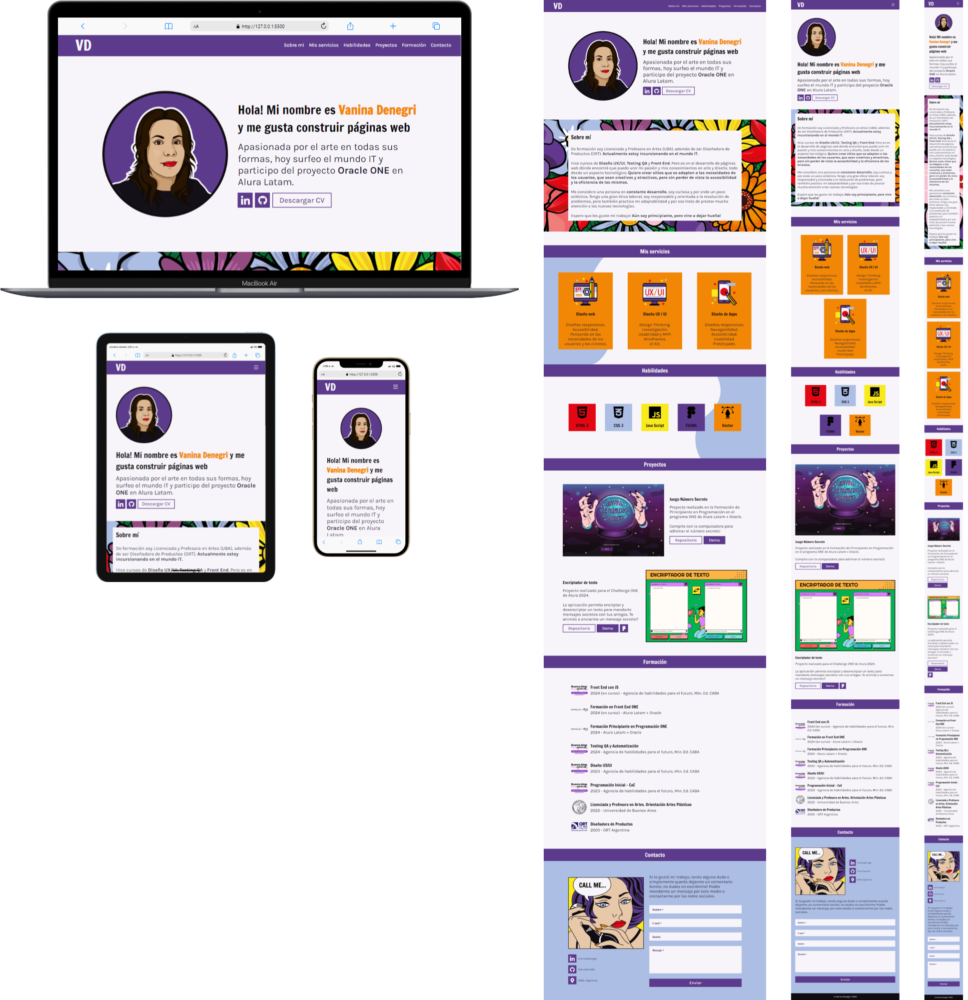

<h1>PORTFOLIO WEB :computer:</h1>

<h2>Estado</h2>

<h2>Tecnologías</h2>

  
 
  

<h2>Descripción del proyecto :bulb:</h2>

Este es mi Portfolio Personal realizado para el Challenge de la Formación en Front End de Alura-Latam + Oracle.
 
 
Quise hacer un diseño que muestre mi estilo personal y mis habilidades en el dibujo vectorial. Pero que al mismo tiempo que sea limpio,sencillo y responsivo.

<h3>Funcionalidad :wrench:</h3>

:small_blue_diamond: La página cuenta con enlaces para una nevegación interna fluída.
 :small_blue_diamond:Se puede bajar y volver a subir.
 :small_blue_diamond: Los enlaces externos se abren en pestañas o páginas diferentes.
 :small_blue_diamond: Cuenta con un formulario funcional, si se ingresan datos me llegarán luego por e-mail.

<h3>Requisitos :clipboard:</h3>

:heavy_check_mark: Diseño responsivo.
 :heavy_check_mark: Navegabilidad: el proyecto debe contener una barra de navegación
     con links que direccionen a cada una de las secciones del portafolio.
 :heavy_check_mark: Debe incluir distintas secciones: sobre mi, habilidades, formación, etc.
 :heavy_check_mark: Debe tener un formulario de contacto funcional.
 :heavy_check_mark: El formulario debe tener elementos de validación para no dejar campos vacíos.

<h3>Extras :star2:</h3>

:heavy_check_mark: Un botón para descargar o ver el CV (currículo).
  :heavy_check_mark: Menú responsivo: la barra de navegación se convierte en un menú "hamburguesa" en dispositivos más pequeños.
  :heavy_check_mark: Botón para volver hacia arriba que aparece/desaparece dependiendo de la posición del scroll.

<h2>Acceso al proyecto :link:</h2>

 
  

<h2>Autoría :woman:</h2>

Esta página fue desarrollada por Vanina Denegri siguiendo el lineamiento planteado por el Challenge de Alura Latam y agregando diseños propios.
 
 
 

<h2>Reconocimientos :crown:</h2>

Herramientas utilizadas en el proyecto:
 
 
 
 
Herramientas utilizadas en este README:
 
 
 

<h2>Muestrame tu apoyo :gift_heart:</h2>

:star: Si te gustó mi proyecto podés dejarme alguna estrellita.
 :e-mail: Mandarme algún mensaje.
 :bell: Seguirme en redes para comentar y compartir.
 :gift_heart: Darme los reconocimientos correspondientes si es necesario.

<h2>Notas finales :exclamation:</h2>

Estos son mis primeros proyectos. Aún me quedan muchas cosas por aprender y mejorar. Si tenés algún comentario para ayudarme a crecer lo recibiré atentamente, siempre y cuando venga con respeto.

<h2>Licencia :warning:</h2>
 

